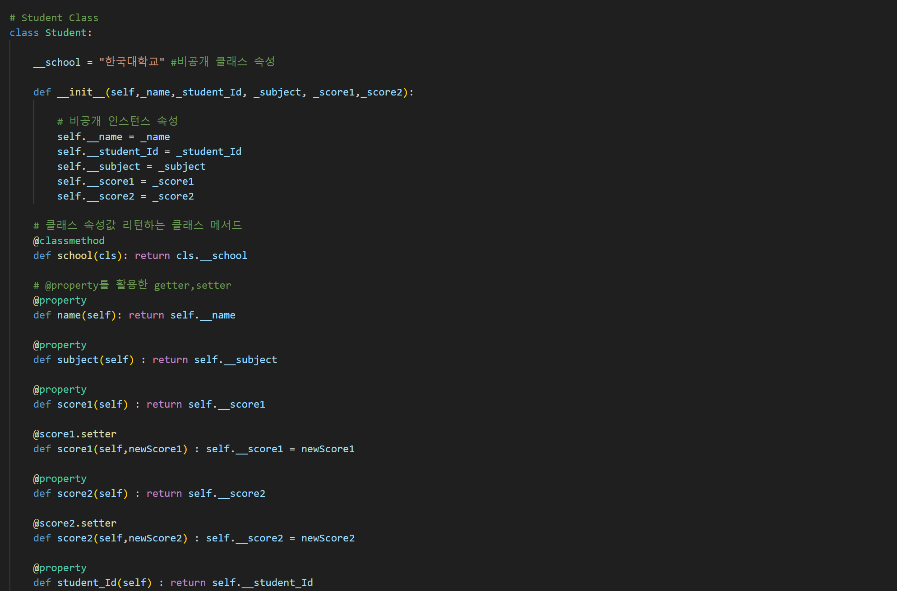

# week_1_python

## 🖥 프로젝트명
- 클래스 기반 학생 성적 관리 프로그램

## 📋 프로젝트 소개 및 기능
- 터미널 창을 통해 학생정보 입력, 학생정보, 조회, 학생성적 변경, 수강인원 출력(저장)를 할 수 있는 프로그램입니다.

## ⚙ 개발환경

## 📌 코드

## 🔨 프로젝트 보완사항
- 파이썬을 접하고 처음하는 프로젝트였습니다. 다소 미숙해서 추후 클래스에 대해 정리를 하였습니다.

- https://gratis-day-85c.notion.site/4789343788d048aba7a1258a21516ca5?pvs=4