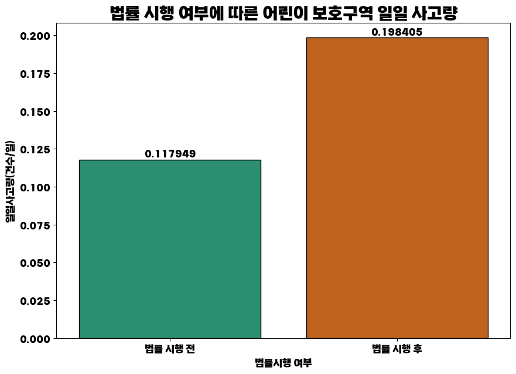
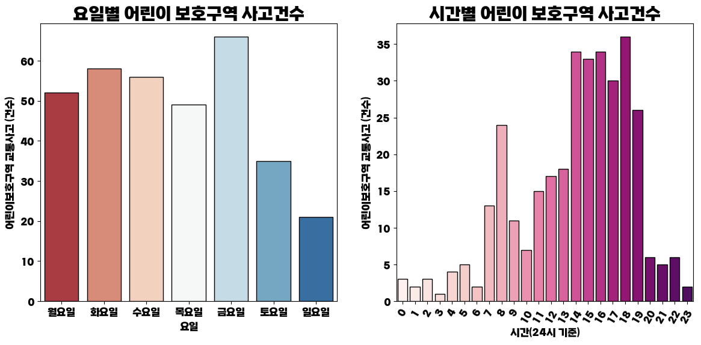
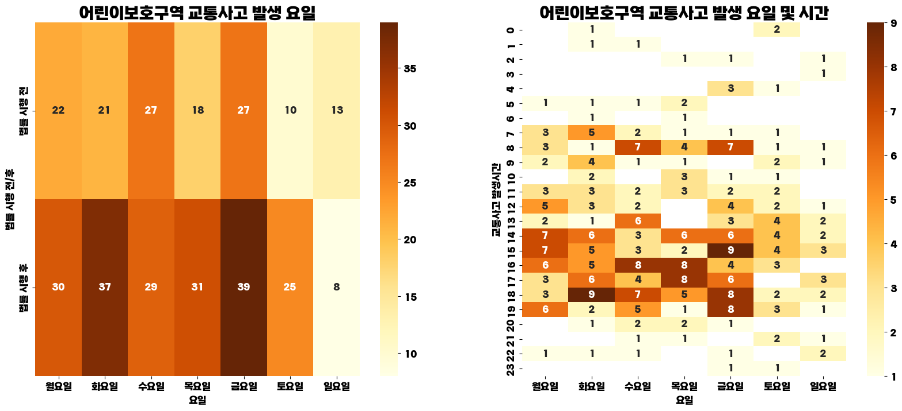
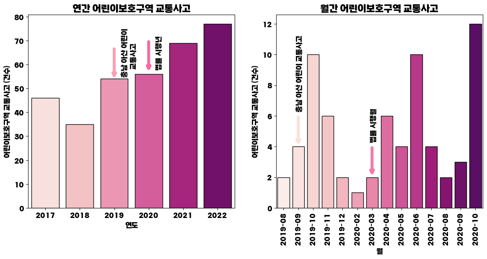
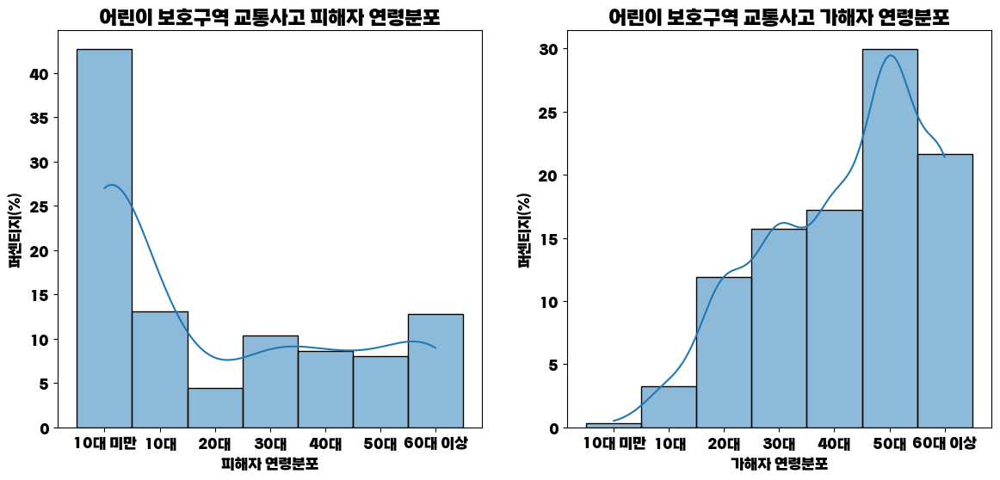
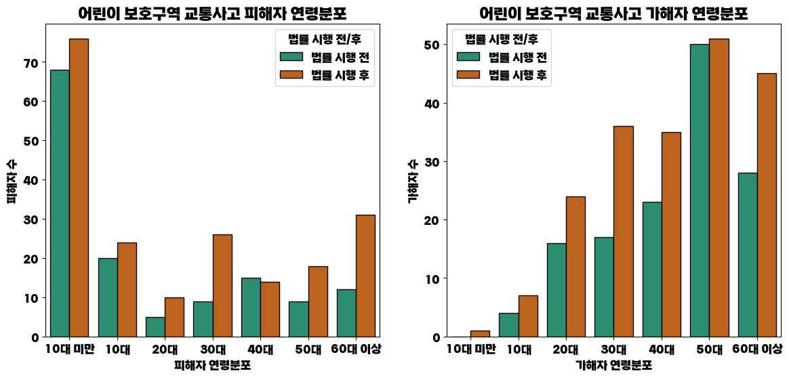
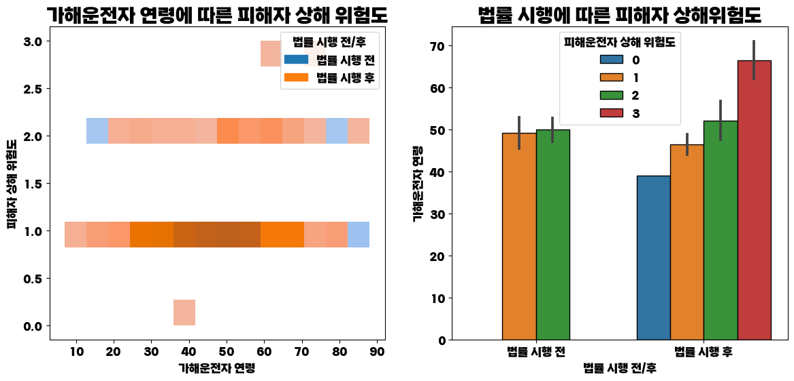
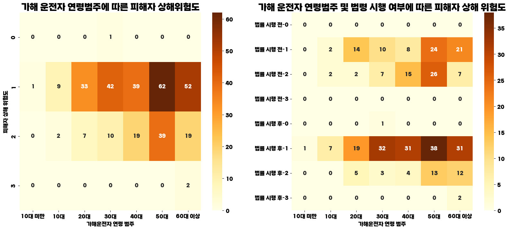

# week_3_visualization

## 🖥 프로젝트명
교통 법령 개정에 따른 대구 내 교통사고 변화 추이

## 📋 프로젝트 소개 및 기능
민식이법 시행 전/후, 대구 내 어린이 보호구역 교통사고를 분석하였습니다.

## ⚙ 개발환경
  

## 프로젝트 세부소개

- 법률 시행 여부에 따른 어린이 보호구역 일일 사고량

- 요일별 어린이보호구역 사고건수와 시간별 어린이 보호구역 사고 건수

- 어린이보호구역 교통사고 발생요일 및 시간

- 연간/월간 어린이 보호구역 교통사고

- 어린이 보호구역 교통사고 피해자/가해자 연령분포

- 가해 운전자 연령/법률 시행에 따른 피해자 상해 피해도

## 🔨 프로젝트 보완사항
- 현재 프로젝트의 경우, 데이터셋의 범위를 대구로 한정지었는데, 다음번에는 전국으로 확대해서 진행하고자 합니다.