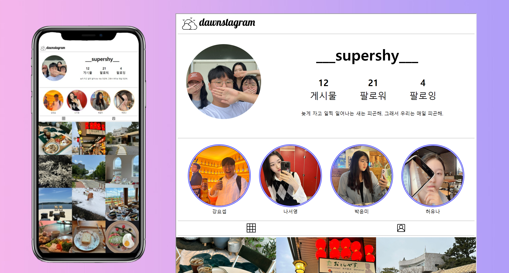
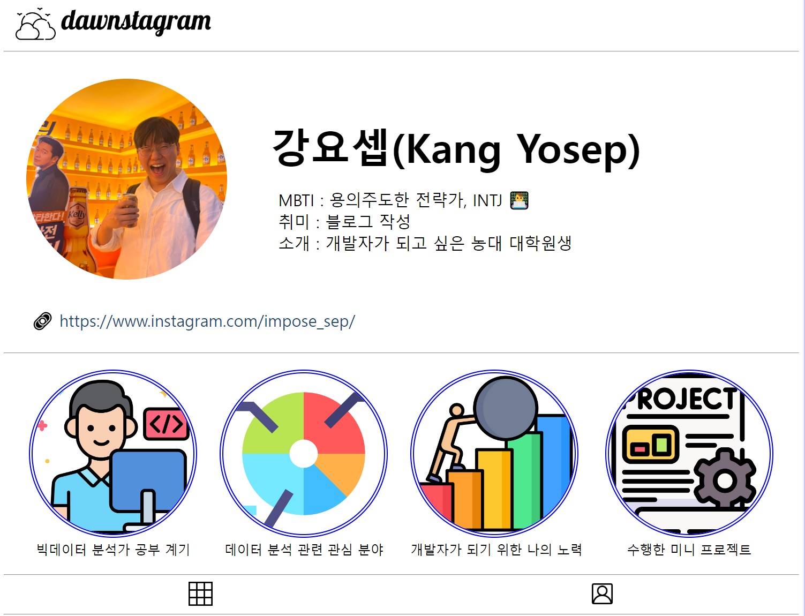
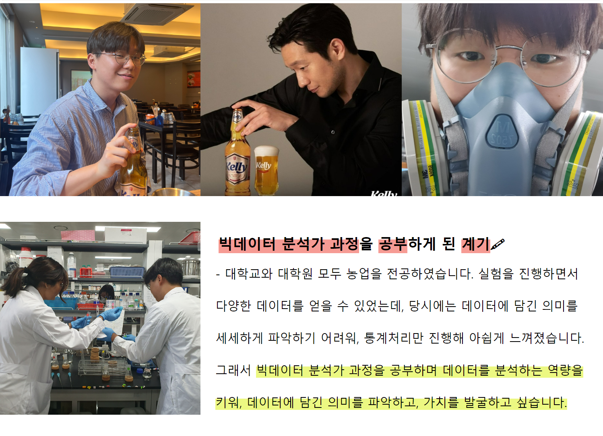
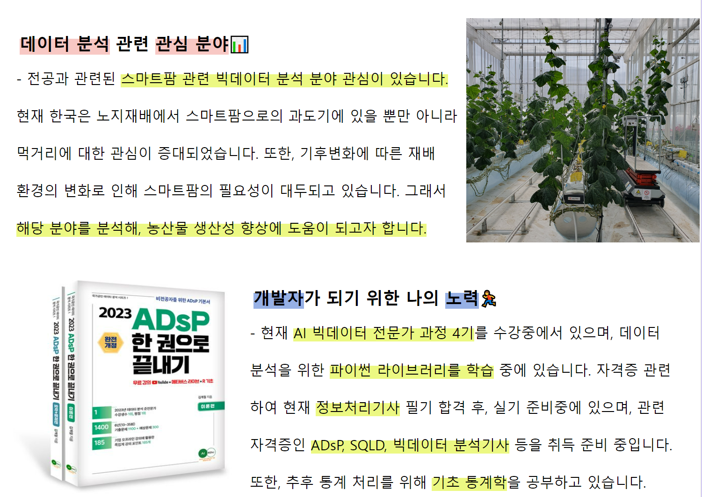
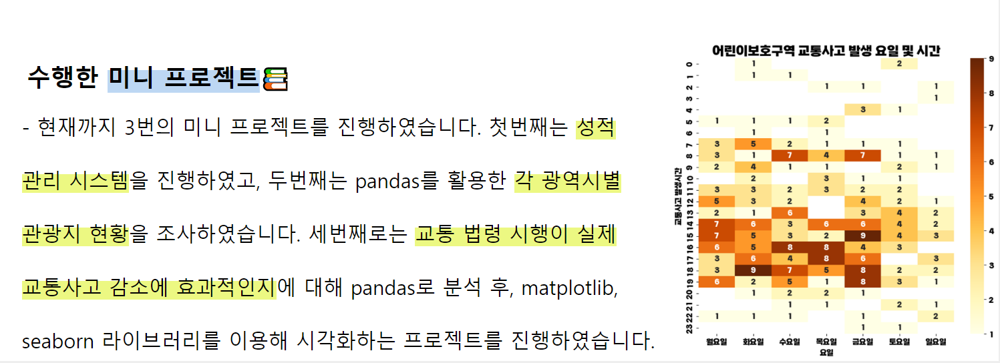

# week_4_web_basic

## 🖥 프로젝트명
**Dawnstagram**

## 📋 프로젝트 소개 및 기능
- HTML과 CSS를 활용한 인스타그램 형태의 자기소개 웹사이트를 구현해보았습니다.
- 메인 페이지는 팀페이지 소개이며, 각자의 사진을 눌러 본인의 자기소개 페이지로 넘어갑니다.
- 자기소개 페이지에서 *dawnstagram* 로고를 눌러 다시 팀페이지로 복귀할 수 있습니다.

## ⚙ 개발환경

  

## 웹사이트 화면
- 팀페이지

- 개인 자기소개 페이지

