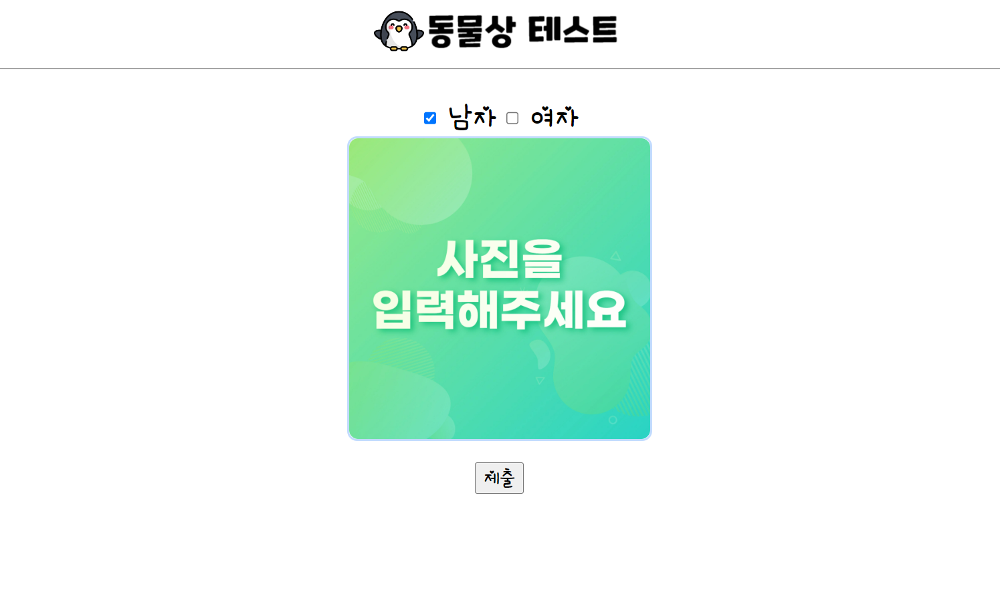
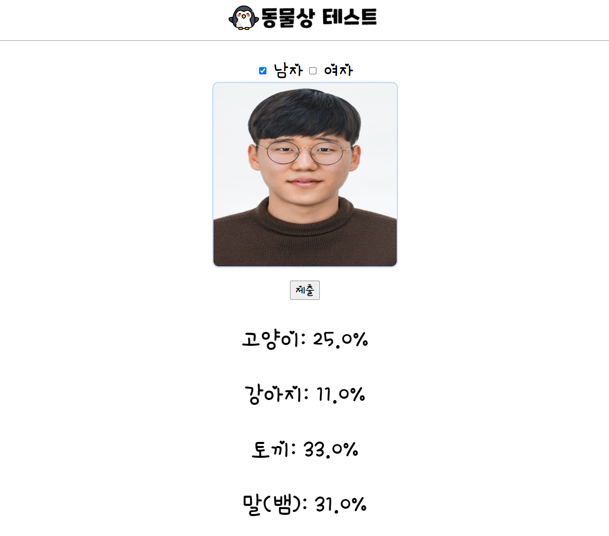

# week_7_opencv

## 🖥 프로젝트명
동물상 테스트 : 나와 닮은 동물 찾기

## 📋 프로젝트 소개 및 기능
- 이미지를 업로드하여 나와 닮은 동물상을 알려주는 서비스입니다. 남자의 경우 고양이,강아지, 토끼, 말상을 구분하고, 여자의 경우 고영이, 강아지, 토끼, 뱀상을 구분합니다.

## ⚙ 개발환경

    

## 웹사이트 화면
- 동물상 테스트 초기 화면

- 동물상 테스트 실행 화면

