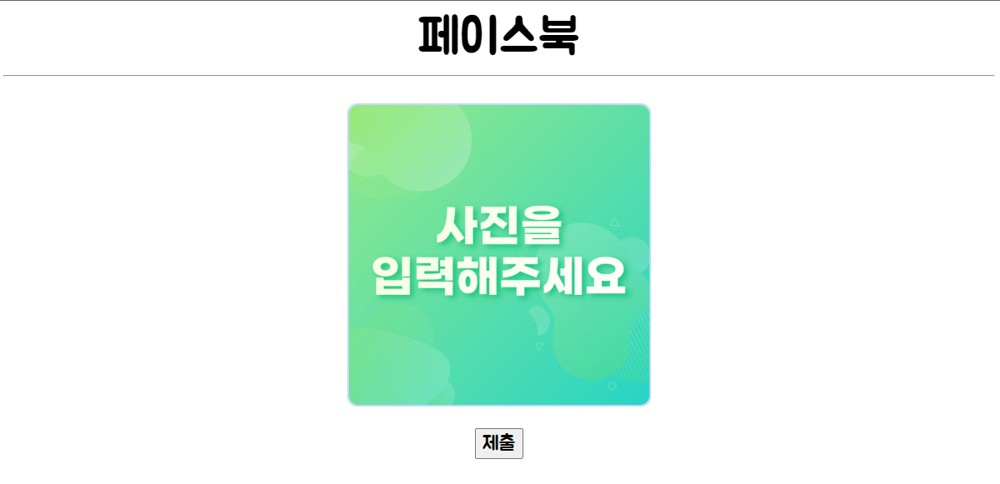

# week_8_dl

## 🖥 프로젝트명
페이스북 : 딥러닝을 통해 얼굴을 다양한 카테고리로 분류하는 서비스입니다.

## 📋 프로젝트 소개 및 기능
- 마법의 모자 : 호구와트 기숙사를 분류해줍니다.

- 쿨톤웜톤 : 쿨톤, 웜톤을 분류해줍니다.

- 얼굴나이 예측: 얼굴을 보고, 미성년층, 청년층, 장년층, 노년층을 분류해줍니다.

- 아이돌상 예측: 내 얼굴형에 맞는 아이돌 그룹을 에스파, 블랙핑크, ITZY, 아이브, 르세라핌, 뉴진스로 분류합니다.

## ⚙ 개발환경

- Web

 
  

 

- Machine Learning Language

 
 

 

- Other tools

   

## 📌 웹사이트 화면

- 초기 화면

- 얼굴 나이 테스트

- 얼굴 나이 테스트 실행 화면

