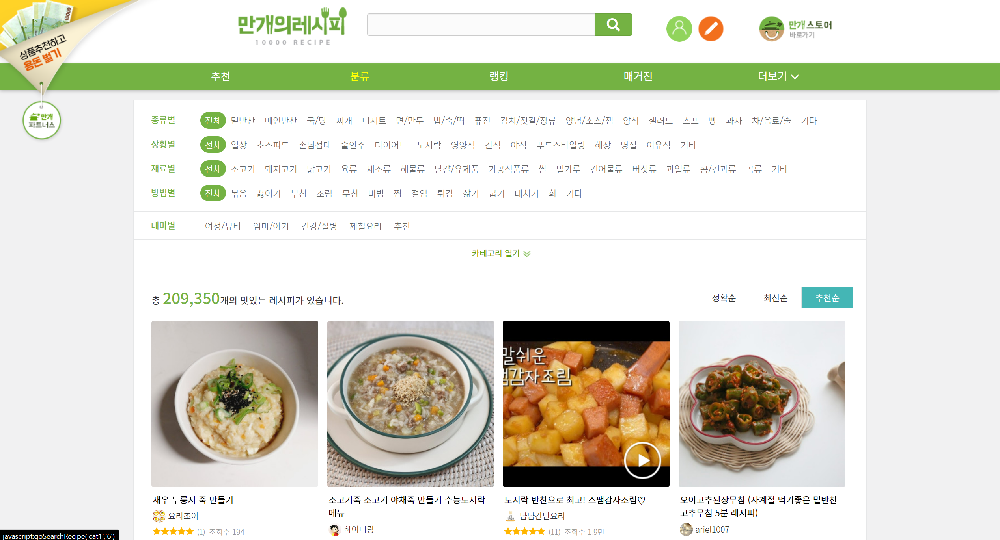

# week_10_sql

## 🖥 프로젝트명
나만의 냉장고를 부탁해

.png)

## 📋 프로젝트 소개 및 기능
- 냉장고 속 남아있는 재료들을 이용하여, 만들 수 있는 메뉴를 추천하는 프로그램을 목표로 하였습니다.

- 만개의 레시피 홈페이지에서 메뉴의 재료 및 레시피를 크롤링하였고, MariaDB에 저장하였습니다.

- countvectorizer된 단어 사전을 생성하고 코사인(cosine) 유사도를 이용해서 메뉴를 추천하고자 하였습니다.

## ⚙ 개발환경

- Web

    

 

- Machine Learning Language

  

 

- DB

 

 

- other tools

  

## 📊 활용 데이터

- 만개의 레시피 홈페이지 분류 탭에서 1만개의 요리 제목, 재료, 레시피를 크롤링하였습니다.

## 📌 프로젝트 세부소개

- onkeydown 이벤트를 통해 request 하도록 하였습니다.

## 🔨 프로젝트 보완사항

- 이번에는 단순히 레시피에 대한 countvectorizer만 진행하였는데, 다음에는 WordEmbedding 처리를 하여 검색에 대한 유사도 부분을 개선할 계획입니다.