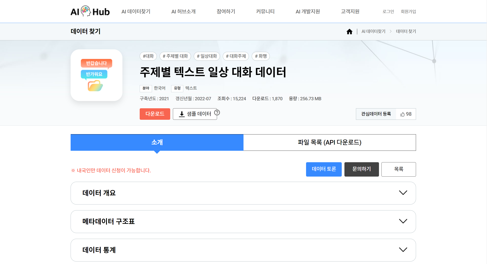

# week_11_flask

## 🖥 프로젝트명
나만의 연애이야기 챗봇 LAI

## 📋 프로젝트 소개 및 기능
- 연애·결혼 이야기를 친구처럼 편하게 할 수 있는 챗봇을 목표로 하였습니다.

- Transformers의 한국어 언어모델인 KoGPT2를 연애·결혼 도메인으로 파인튜닝해서 챗봇을 구현하였습니다.

- Flask를 활용하여 백엔드 구축을 하였고, SQLAlechemy를 활용해 ORM 방식으로 MariaDB를 연동하였습니다.

- 회원가입, 로그인 기능을 구현하였고, 로그인 시 사용자 개인의 과거 채팅 기록을 유지하였습니다.

## ⚙ 개발환경

- Web

    

 

- Machine Learning Language

 
  

 

- DB

 

## 📊 활용 데이터
- AI Hub에서 주제별 텍스트 일상 대화 데이터를 활용하였습니다.

- JSON 데이터셋에서 연애·결혼 주제를 추출해 전처리를 진행하였습니다.

## 📌 프로젝트 세부소개

- DB에 이미 존재하는 이메일의 경우, 회원가입 제한사항을 걸어두었습니다.

.png)

- 이메일 양식이 맞지 않는 경우, 회원가입 제한사항을 걸어두었습니다.

.png)

- 이메일과 비밀번호가 DB정보와 맞지 않는 경우 로그인이 되지 않도록 제한사항을 걸어두었습니다.

.png)

- 사용자의 이름을 DB에서 가져와, jinja2를 이용하여 초기화면을 변경하였습니다.

.png)

- ‘이야기 시작하기’ 버튼을 누르면 과거 채팅 기록이 로드되고, 대화를 할 수 있습니다. 

.png)

## 🔨 프로젝트 보완사항

- 현재의 채팅의 경우 Form 태그를 POST 받는 방식으로 진행되는데, 이로 인해 매번 채팅화면이 redirect되는데, 이 부분을 AJAX로 보완 할 계획입니다.

- 현재 실행되는 모델의 경우, 코랩 기준 V100 GPU 기준 1 EPOCH 당 20분이 소요되어 많이 학습하지 못했는데, EPOCH 수를 높여 새로운 모델로 보완 할 계획입니다.